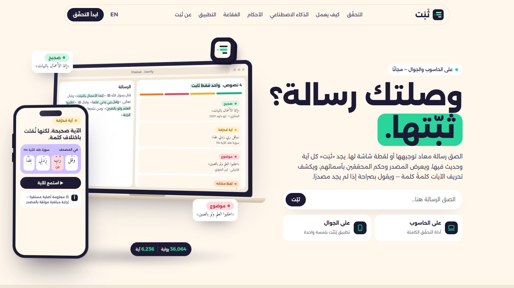
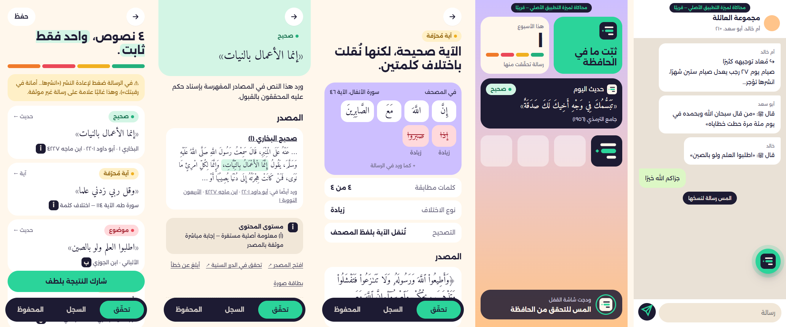
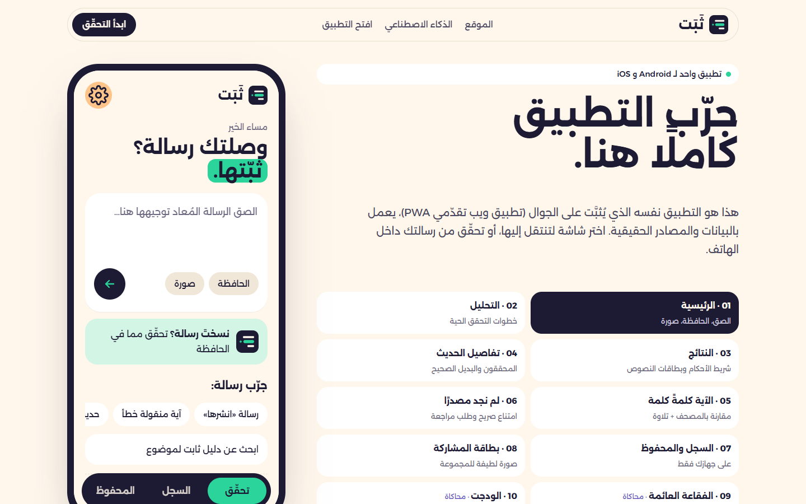
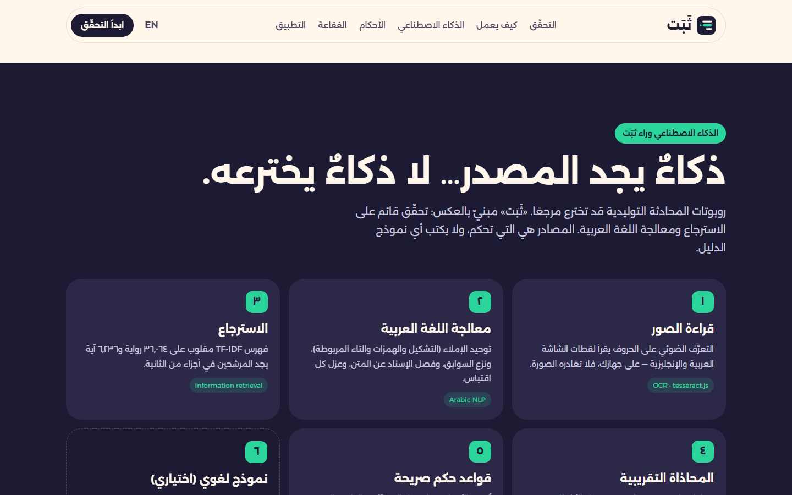

<div align="center">


# ثَبَت · Thabat

**وصلتك رسالة؟ ثبّتها.** Got a forwarded message? Verify it before you share it.

Verifies the Quran verses and hadith in forwarded messages against the sources, with each scholar's grading by name.

*Entry for **Track 04: Knowledge & verification tools**, AI in Service of Islamic Content Challenge 2026 ([IslamicAIch.org](https://islamicaich.org)). Built by **Youcef Kouadria**.*

[Run it](#run-it-on-your-computer-for-the-judges) · [Live demo](https://islamicaich.vercel.app) · [App (PWA)](#the-app) · [How the AI works](#how-the-ai-works) · [Results](#measured-results) · [Docs](#documentation)

</div>



## Live demo, video and presentation

| | |
|---|---|
| 🌐 **Live demo** | https://islamicaich.vercel.app — desktop tool at [`/verify`](https://islamicaich.vercel.app/verify), the app in a phone frame at [`/mobile`](https://islamicaich.vercel.app/mobile) |
| 🎬 **Video (2:00)** | [`video/thabat_film120.mp4`](video/thabat_film120.mp4): an animated film with an original score; every verdict on screen comes from the live engine |
| 📊 **Presentation** | [`presentation/Thabat_Presentation.pdf`](presentation/Thabat_Presentation.pdf) · [PPTX](presentation/Thabat_Presentation.pptx): 36 slides on the official template |

## The problem

Messages that start with «قال رسول الله ﷺ» or quote a verse travel through family groups every day. Some are authentic. Some are fabricated, weak, or a verse quoted with a wrong word. The person who receives one rarely has the tools or time to check, and generic AI chatbots can make it worse by **inventing a reference**.

## What Thabat does

Paste a message or share a screenshot. For **every quote in it**, Thabat:

| | |
|---|---|
| 📖 **Finds the source** | Surah and ayah, or the collection and hadith number, with a link to quran.com / sunnah.com |
| ⚖️ **Shows the grading by name** | al-Albani, Shu'ayb al-Arna'ut, Zubair Ali Zai, Ahmad Shakir… exactly as published. If scholars differ, all gradings are shown |
| 🔤 **Checks verses word by word** | A misquoted verse shows which words differ from the Mushaf, with the correct wording and a recitation |
| 🚫 **Abstains honestly** | "No source found" is never presented as "fabricated". It refers you to a specialist |
| 🧭 **Stays in scope** | Every result carries the annex's content level (أ/ب/ج/د). Fatwa requests are referred, not answered |
| 💬 **Helps you reply kindly** | A gentle reply in Arabic, English, French, Indonesian or Turkish, with an authentic alternative, or a verdict card image for the group |

## The app

One codebase serves the website and an **installable mobile app (PWA)** for Android and iPhone. Native-only features (floating bubble, widgets, iOS share sheet, WhatsApp bot) are shown as **clearly labelled simulations that call the real engine**. The native store apps are *coming soon*.



| Feature | Status |
|---|---|
| Paste, screenshot (OCR on the device), clipboard | ✅ live |
| Results, hadith detail with the source passage, verse word tiles, listen to the verse | ✅ live |
| Reply in 5 languages, verdict card PNG, result link, WhatsApp share | ✅ live |
| History and saved items, stored **on the device only** | ✅ live |
| Evidence search by topic (verses + authentic hadith only) | ✅ live |
| Install to the home screen, offline app shell, app shortcuts | ✅ live |
| **Share a WhatsApp message into Thabat** (Android share target) | ✅ live once installed |
| Floating bubble, widgets, iOS share sheet, WhatsApp bot | 🧪 simulation in the app · native version *coming soon* |
| App Store / Google Play, Telegram bot, more hadith books | 🔜 coming soon |

**For judges:** open **`/mobile`** to use the full app inside a phone frame, or scan its QR code to open it on your own phone.



## How the AI works

> **AI that finds the source, not AI that invents one.**

Thabat uses **retrieval-based verification with Arabic NLP**. It is **not RAG**: no language model writes the answer. Every verdict is built from the source record itself, with fixed rules that can be reviewed.

```
message ─▶ ① OCR (on device) ─▶ ② Arabic NLP: normalise, strip lead-ins & pressure, split isnad/matn
        ─▶ ③ TF-IDF retrieval over 36,064 narrations + 6,236 verses
        ─▶ ④ fuzzy alignment + word-level diff against the Mushaf
        ─▶ ⑤ rules: named gradings, register, abstention, annex level أ–د, scope guard
        ─▶ verdict + source + reply
   (⑥ optional LLM, off by default: only locates quotes in messy messages; never grades or cites)
```

The website has a full section on this (`/#ai`). Details are in [docs/METHODOLOGY.md](docs/METHODOLOGY.md); every AI tool, in the product and in its making, is listed in [docs/AI_USAGE.md](docs/AI_USAGE.md).



## Measured results

From [`eval/results/REPORT.md`](eval/results/REPORT.md), deterministic core:

| Metric | Result |
|---|---|
| Curated cases (73, 10 categories, including the annex's own test types) | **98.6%** correct |
| Critical errors (calling a non-established text authentic or the reverse, answering a fatwa request, inventing evidence) | **0** |
| True source found from a random Arabic phrase with phone-typing noise | **98.5%** recall@3 (exact search: **0%**) |
| Same, English translations | **97%** recall@3 |
| Repeated runs | identical output |
| Speed and footprint | ~28 ms per message · ~0.3 s cold load · ~120 MB RAM |

These cases were written during development, so the figures are optimistic. A held-out test set written by a specialist is the next benchmark.

## Why it can be trusted

- **The sources decide, never the AI.** Quran text (Tanzil) and hadith text and gradings are shown verbatim. Sacred text is never typed by hand or generated.
- **Human review with verified reviewers.** Specialists apply at `/join`; the admin verifies and approves them, and each gets a personal access code (only its hash is stored). Popular sayings in the register stay *draft* until an approved specialist signs them on `/review`. Every decision is logged with the reviewer's verified name and time, and accounts can be revoked.
- **Conflicts are shown, not hidden:** scholars who disagree; a phrase graded differently from its full narration; a Companion's words attributed to the Prophet ﷺ; a verse quoted as a hadith.
- **Private by design:** messages are not stored; screenshots never leave the device; history stays on the phone. See the [privacy policy](public/privacy.html).

## Run it on your computer (for the judges)

Everything needed is in this repository, including the compiled corpus (`data/dist/`, 111 MB), so **nothing is downloaded at runtime and no account or API key is needed**. It takes about two minutes.

### 1. Requirements

- **Python 3.12 or newer** ([python.org/downloads](https://www.python.org/downloads/)). On Windows, tick *"Add python.exe to PATH"* during installation.
- **Git** ([git-scm.com](https://git-scm.com/downloads)), or download the repository as a ZIP from GitHub (*Code → Download ZIP*).
- About 400 MB of free disk space and 300 MB of RAM.

### 2. Get the code

```bash
git clone https://github.com/youmrx3/islamicaich.git
cd islamicaich
```

### 3. Install (in a virtual environment)

**Windows (PowerShell)**

```powershell
python -m venv .venv
.venv\Scripts\Activate.ps1
pip install -r requirements-dev.txt
```

**macOS / Linux**

```bash
python3 -m venv .venv
source .venv/bin/activate
pip install -r requirements-dev.txt
```

### 4. Start Thabat

```bash
python -m uvicorn index:app --port 8000
```

Open **http://localhost:8000** in your browser. To check the server and the data, open http://localhost:8000/api/health. It should say `"ok": true`, `"hadith_records": 36064` and `"quran_verses": 6236`.

### 5. What to try

| Open | What you will see |
|---|---|
| `http://localhost:8000/` | The website, with live examples from the engine |
| `/verify` | **The full desktop tool.** Paste a message, or press one of the «جرّب» examples |
| `/verify?ex=0` | A forwarded message with an authentic hadith, a misquoted verse, a fabricated saying and forwarding pressure |
| `/verify?ex=1` | A misquoted verse, compared word by word with the Mushaf |
| `/verify?ex=2` | A made-up hadith: «no source found» (abstention, not a false verdict) |
| `/verify?ex=5` | A personal fatwa request: level د, referral instead of a ruling |
| `/verify?mode=search&sq=بر الوالدين` | Evidence search: only authentic verses and hadith, with sources |
| `/app` · `/mobile` | The mobile app (PWA), and the app inside a phone frame |
| `/about` | The maker, the idea of the logo and the brand identity |
| `/join` · `/review` | Apply as a reviewer, and the reviewer/admin sign-in (locally, without `REVIEW_TOKEN`, any password signs you in as admin) |
| `/api/docs` | The interactive API documentation |

To test reports and review decisions locally, no database is needed: they are written to `data/flags/*.jsonl` (ignored by git). Supabase is only used when its environment variables are set.

### 6. Run the tests and the evaluation

```bash
cd backend && python -m pytest tests -q && cd ..   # 28 tests, about 3 seconds
python eval/run_eval.py                             # regenerates eval/results/REPORT.md
```

### Optional

- **Docker**, instead of steps 3–4: `docker build -t thabat .` then `docker run -p 7860:7860 thabat`, and open http://localhost:7860.
- **The optional language model**: set `ANTHROPIC_API_KEY` before starting. Without it, Thabat runs fully on its deterministic engine, which is how all the reported results were measured.
- **Rebuilding the corpus from the original sources** (not needed): `python scripts/build_data.py && python scripts/build_index.py`.

### Troubleshooting

| Problem | Fix |
|---|---|
| `python` is not found (Windows) | Use `py` instead of `python`, or reinstall Python with *Add to PATH* |
| `Activate.ps1 cannot be loaded` (Windows) | Skip activation and use `.venv\Scripts\python -m pip …` and `.venv\Scripts\python -m uvicorn …` |
| Port 8000 is already in use | Use another port: `python -m uvicorn index:app --port 8010` |
| Arabic fonts look different | The pages load the Alexandria and Amiri fonts from Google Fonts, so an internet connection gives the intended look; everything works offline too |

### Deploy (Vercel)

Import the repository in Vercel (FastAPI is detected; no build step). Then set:

| Variable | Purpose |
|---|---|
| `SUPABASE_URL` | Supabase project URL. Run [`supabase/schema.sql`](supabase/schema.sql) once in the SQL editor (existing projects: `supabase/migrations/002_reviewers.sql`) |
| `SUPABASE_SERVICE_ROLE_KEY` | Server-side key for storing reports and review decisions (never committed or sent to the browser) |
| `REVIEW_TOKEN` | Admin password for `/review` (approves reviewer accounts, reads reports) |
| `ANTHROPIC_API_KEY` | *Optional* LLM quote extraction |

Full guide: [docs/DEPLOY.md](docs/DEPLOY.md).

## Repository

```
index.py              ASGI entry point (Vercel) → backend.app.main:app
backend/app/          normalize · corpus · matching · grades · verify · scope · search · replies · llm · flags · main
backend/tests/        safety, annex and API tests
public/               index.html (website) · verify.html (desktop tool) · app.html (PWA) · mobile.html · about.html · join.html · review.html · privacy.html
  assets/             site.* · app.* · verify.* · about.* · brand/ · brandbook/ · icons/ · team/
  manifest.webmanifest, sw.js
data/dist/            compiled corpus (36,064 narrations + 6,236 verses)
data/curated/         registry.json (popular sayings, under review) · daily.json (hadith of the day)
supabase/             schema.sql + migrations/: reports, review decisions, reviewer accounts (RLS)
eval/                 cases, runner, results
docs/                 methodology · reliability · AI usage · sources · operations · baseline · deploy
presentation/         the final presentation (PDF + PPTX, official template)
video/                the 2-minute film (MP4), its source (film120.html), the renderer and the score generator
CHALLENGE_LOG.md      what was built during 4–6 October 2026
```

## Documentation

[Methodology](docs/METHODOLOGY.md) · [Reliability & annex compliance](docs/RELIABILITY.md) · [AI usage disclosure](docs/AI_USAGE.md) · [Sources & licences](docs/SOURCES.md) · [Operations & cost](docs/OPERATIONS.md) · [Starting-version disclosure](docs/BASELINE.md) · [Challenge log](CHALLENGE_LOG.md) · [Deploy](docs/DEPLOY.md) · [Registration proposal (AR)](docs/PROPOSAL_AR.md)

## Challenge compliance

- **Judged work:** only 4–6 October 2026. Prior work is declared by the tag `baseline-pre-challenge` and described in [docs/BASELINE.md](docs/BASELINE.md); the challenge-days work is in [CHALLENGE_LOG.md](CHALLENGE_LOG.md).
- **Scientific annex:** content levels أ–د, the mandatory standard, approved references and the test types are covered in [docs/RELIABILITY.md](docs/RELIABILITY.md).
- **Disclosure:** every dataset, library, service and AI tool, with its licence, is in [SOURCES.md](docs/SOURCES.md) and [AI_USAGE.md](docs/AI_USAGE.md). No real user data was used.

## Licence

Code © 2026 Youcef Kouadria, published for the challenge's evaluation (see [`LICENSE`](LICENSE)).
Data: Tanzil Quran text (CC BY 3.0, verbatim) and fawazahmed0/hadith-api (Unlicense). Fonts: Alexandria and Amiri (OFL). Full list in [docs/SOURCES.md](docs/SOURCES.md).
