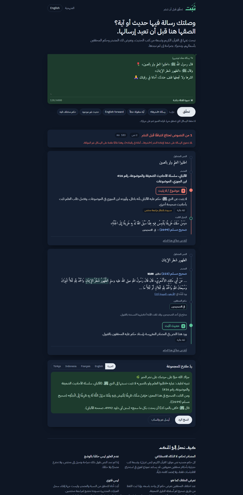

# ثَبَت · Thabat — verify before you forward

> **ثَبَت** أداة تتحقق من الأحاديث والآيات المتداولة في رسائل واتساب ووسائل التواصل قبل نشرها: تحدد مصدر كل نص في القرآن الكريم وتسعة من كتب الحديث، وتعرض حكم المحققين بأسمائهم، وتكشف تحريف لفظ الآيات كلمةً كلمة، وتمتنع بصراحة حين لا تجد مصدرًا، ثم تقترح ردًّا لطيفًا بخمس لغات مع بديل صحيح ثابت.
>
> Entry for **Track 04 — Knowledge & verification tools** of the *AI in Service of Islamic Content Challenge 2026* (IslamicAIch.org).



## What it does

Paste a forwarded message, or upload a screenshot (read on your device). For every quote inside it, Thabat shows:

1. **Where it comes from:** Quran surah and ayah, or hadith collection and number, linked to quran.com / sunnah.com.
2. **What the scholars said:** every grader by name (al-Albani, Shuaib al-Arnaut, Zubair Ali Zai, Ahmad Shakir…) with their exact label. Disagreement is shown, not hidden.
3. **One clear status:** exact verse · misquoted verse (with word diff) · authentic · sound but not the Prophet's words ﷺ · disputed · weak · fabricated · baseless · **not found** (honest abstention, never "fabricated").
4. **An authentic alternative:** "اطلبوا العلم ولو بالصين" is not established, but "من سلك طريقا يلتمس فيه علما…" (Muslim 2699) is.
5. **A ready reply for the group** in Arabic, English, French, Indonesian or Turkish: thanks the sender, gives the finding with its source, offers the alternative.
6. **Forwarding-pressure warning:** flags "انشرها… أمانة في رقبتك" / "forward to 10 people".

## Results (deterministic core, `eval/results/REPORT.md`)

| Metric | Result |
|---|---|
| Curated cases (65, 9 categories) | **98.5%** correct |
| Critical errors (non-established called authentic, or the reverse) | **0** |
| Find the true source of a random Arabic phrase, with phone-typing noise | **98.5%** recall@3 (exact search: 0%) |
| Same, English translations | **97%** recall@3 |
| Repeated runs | identical output |
| Median latency | ~60 ms per message, CPU only |

These curated cases were written during development, so the figures are optimistic. A held-out, specialist-written test set is part of the challenge-days plan.

## Why it can be trusted

- **Sources decide, never the AI.** Verdicts come only from verbatim source data and fixed, reviewable templates. An optional LLM may help locate quotes or propose an Arabic search query, and anything found that way is labelled.
- **Not found ≠ fabricated.** The system abstains and refers to a specialist.
- **Conflicts are explicit:** grader disagreement, a phrase graded differently from its full narration, a Companion's words attributed to the Prophet ﷺ, a verse quoted as hadith.
- **Human in the loop:** a draft register under specialist review, plus user flags into a review queue.

Details: [Methodology](docs/METHODOLOGY.md) · [Reliability plan](docs/RELIABILITY.md) · [Sources & licences log](docs/SOURCES.md) · [Operations & cost](docs/OPERATIONS.md) · [Starting-version disclosure](docs/BASELINE.md) · [Deploy](docs/DEPLOY.md)

## Quick start

```bash
pip install -r requirements-dev.txt
python scripts/build_data.py
python -m uvicorn app.main:app --app-dir backend --port 8000
```

Try `http://localhost:8000/?ex=1` (misquoted verse) or `/?ex=2&lang=en`.

## Repository layout

```
backend/app/     normalize · corpus (index) · matching (Quran diff, hadith) · grades · verify (pipeline)
                 replies (5-language templates) · llm (optional) · main (FastAPI)
backend/tests/   safety-invariant unit tests
frontend/        single-page app (ar/en), review page
data/curated/    registry.json — curated popular sayings (draft, pending specialist review)
scripts/         build_data.py — downloads and compiles the corpora
eval/            cases.json, run_eval.py, results/REPORT.md
docs/            methodology, reliability, sources, operations, baseline, deploy, screenshots
proposal/        registration proposal (Arabic), pitch outline, demo script
```

## Licence

Code: © 2026 the Thabat team. Published for the challenge's evaluation (see `LICENSE`).
Data: Tanzil Quran text (CC BY 3.0, verbatim) and fawazahmed0/hadith-api (Unlicense). Full list in [docs/SOURCES.md](docs/SOURCES.md).
